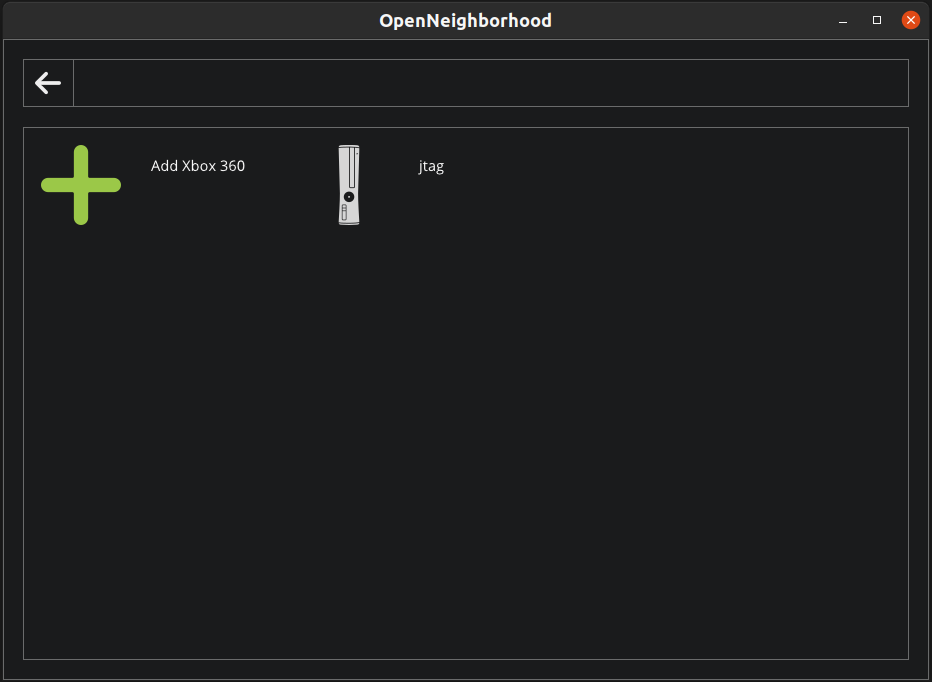
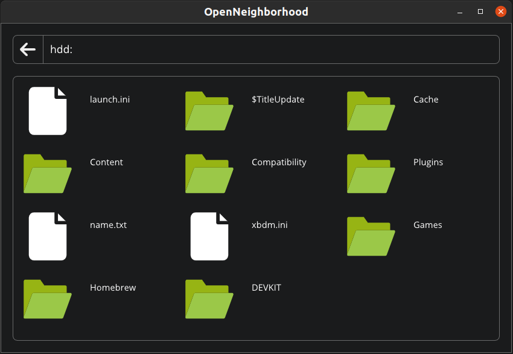

[](https://github.com/ClementDreptin/OpenNeighborhood/actions/workflows/build.yml)

# OpenNeighborhood

<div align="center"></div>

Cross-platform clone of Xbox 360 Neighborhood.

## Screenshots

Home | Root of Hdd
--- | ---
 | 

## Disclaimer

**There are no prebuilt binaries for any platform at the moment, the only way to use OpenNeighborhood is to compile it from source.**


## Compiling

### Generating the project files / Makefiles

Windows
- Visual Studio
    ```
    .\scripts\genprojects-win-vs.bat
    ```
- Cygwin / MinGW
    ```
    .\scripts\genprojects-win.bat
    ```

Linux / macOS
```
./scripts/genprojects-posix.sh
```

### Building

Windows
- Visual Studio
    ```
    Open .\build\OpenNeighborhood.sln in Visual Studio
    ```
    or, if you have `msbuild` in your `PATH`
    ```
    msbuild /p:Configuration=<debug|release> .\build\OpenNeighborhood.sln
    ```
- Cygwin / MinGW
    ```
    cd build && make config=<debug|release>
    ```

Linux / macOS
```
cd build && make config=<debug|release>
```
