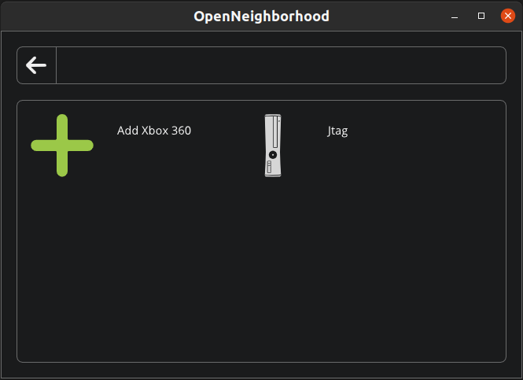
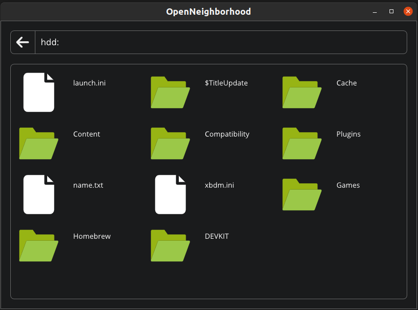

[](https://github.com/ClementDreptin/OpenNeighborhood/actions/workflows/build.yml)

# OpenNeighborhood
Open-source and cross-platform clone of Xbox 360 Neighborhood.

Home | Root of Hdd
--- | ---
 | 

## Disclaimer
**There are no prebuilt binaries for any platform at the moment, the only way to use OpenNeighborhood is to compile it from source.**


## Compiling

### Generating the project files / Makefiles

Windows
- Visual Studio
    ```
    .\scripts\genprojects-win-vs.bat
    ```
- Cygwin / MinGW
    ```
    .\scripts\genprojects-win.bat
    ```
macOS
```
./scripts/genprojects-macos.sh
```

Linux
```
./scripts/genprojects-linux.sh
```

### Building

Windows
- Visual Studio
    ```
    Open OpenNeighborhood.sln in Visual Studio
    ```
- Cygwin / MinGW
    ```
    make config=<debug|release>
    ```
macOS / Linux
```
make config=<debug|release>
```
